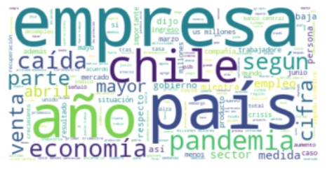
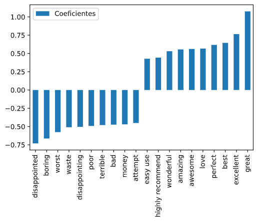
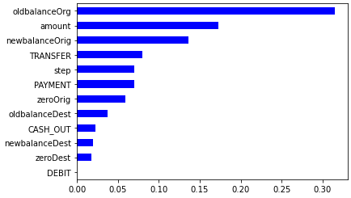
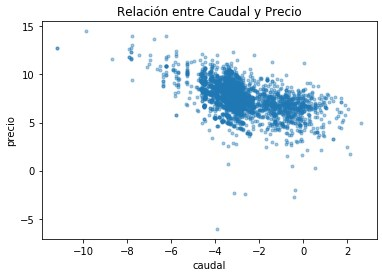
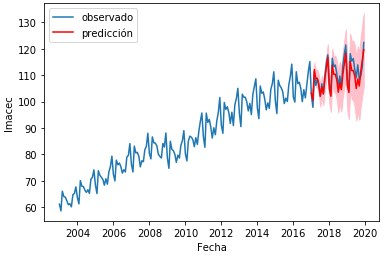

# Guillermo Acuña
Mi nombre es Guillermo Acuña, economista especialista en econometría, data science y machine learning. 

Este es mi portafolio, el espacio donde comparto algunos de mis trabajos, especialmente en las áreas de data science y machine learning.

Si deseas contactarme me puedes encontrar en mis redes sociales:
- [Twitter](https://twitter.com/guillermoacuna)
- [LinkedIn](https://www.linkedin.com/in/guillermoacuna/)

Además tengo un [sitio web](https://sites.google.com/view/guillermoacuna/home) donde puedes encontrar información adicional.

## Mis artículos para EDALab
- [Por qué usar software open source](https://www.edalab.cl/data-science/por-que-usar-software-open-source/)
- [Cómo construir índices económicos](https://www.edalab.cl/economia/como-construir-indices-economicos/)
- [Machine learning: ¿Qué significa que los algoritmos aprendan?](https://www.edalab.cl/data-science/machine-learning-que-significa-que-los-algoritmos-aprendan/)

## Mis contribuciones académicas
- [Google Scholar](https://scholar.google.cl/citations?user=lV-J7MsAAAAJ&hl)
- [ResearchGate](https://www.researchgate.net/profile/Guillermo_Acuna3)
- [Ideas](https://ideas.repec.org/e/pac70.html)

## Análisis del sentimiento de las noticias económicas en Chile (NLP)
Este es un proyecto en desarrollo, que inicié en abril del año 2020. Por ahora tengo algunos análisis preliminares, que listo a continuación:

### [Clústering de textos económicos](https://nbviewer.jupyter.org/github/guillermoacuna-lab/portfolio/blob/main/Text%20Clustering.ipynb)
En este análisis se clasifican las noticias económicas, en base a un algoritmo de clústering, para encontrar patrones asociados a los diferentes tipos de noticias. Esta técnica es muy interesante, ya que se puede utilizar para clasificar las respuestas de preguntas abiertas en una encuesta, en que hacerlo de forma manual podría ser muy intensivo en tiempo. 

### [Clasificación del sentimiento de las noticias económicas](https://nbviewer.jupyter.org/github/guillermoacuna-lab/Portafolio/blob/main/SentimentNews.ipynb)
En este análisis verifico por primera vez si es posible predecir el sentimiento de las noticias económicas con precisión. Con este objetivo comparé el desempeño de una regresión logística, una red neuronal artificial, una red neuronal con embeddings y LSTM. Sin embargo, por el momento la base de datos es pequeña, contiene menos de 1000 observaciones, por lo que no se obtienen resultados excelentes, especialmente en el caso de las redes neuronales que tienden a sobreajustarse a los datos. Este análisis se irá actualizando a medida que obtenga más datos.

## Algoritmos de Clasificación

### [Churn prediction (Predicción de la tasa de cancelación de clientes)](https://nbviewer.jupyter.org/github/guillermoacuna-lab/Portafolio/blob/main/Churn.ipynb)
En este análisis se muestra cómo predecir la tasa de fuga de clientes (Churn rate) usando una base de datos de Kaggle y tres algoritmos de clasificación: Regresión Logística, Random Forest y XGBoost.

### [Sentiment Analysis de IMDB reviews](https://nbviewer.jupyter.org/github/guillermoacuna-lab/Portafolio/blob/main/SentimentAnalysis.ipynb)
En esta notebook se analizan los comentarios que califican las películas de IMDB. Se ajustan dos modelos para clasificar dichos comentarios como negativos y positivos: Naive Bayes y Logistic Regression.

### [Fraud detection (Detección de fraude)](https://nbviewer.jupyter.org/github/guillermo-acuna/Portafolio/blob/main/SFDanalysis.ipynb)
En este ejercicio se hacen predicciones de transacciones fraudulentas con una gran variedad de modelos de Machine Learning: Logistic Regression, Support Vector Machines, Decision tree, Random Forest, AdaBoost y XGBoost.

## Algoritmos de Regresión

### [Predicción de los precios de los derechos de agua en Chile](https://nbviewer.jupyter.org/github/guillermoacuna-lab/Portafolio/blob/main/VAC.ipynb)
En este ejercicio se comparan varios algoritmos de predicción de variables continuas, lo que comúnmente denominamos análisis de regresión. La variable a predecir son precios registrados en transacciones de derechos de agua en Chile, que se caracterizan por ser muy variables y contener una gran cantidad de valores outliers. Se comparan algunos modelos que provienen de la econometría con algoritmos típicos de machine learning.

## Modelos de series de tiempo: ARIMA

### [Predicción del Imacec](https://nbviewer.jupyter.org/github/guillermoacuna-lab/Portafolio/blob/main/ForecastingImacec.ipynb)
En este ejercicio se hace una predicción del Imacec, el índice mensual de actividad económica, publicado por el Banco Central de Chile. El objetivo es ilustrar cómo utilizar modelos ARIMA estacionales (SARIMA) para hacer predicciones de series temporales.

## Marketing analysis

### [Customer segmentation analysis](https://nbviewer.jupyter.org/github/guillermoacuna-lab/Portafolio/blob/main/CustSeg.ipynb)
En este ejercicio muestro cómo hacer diferentes tipos de análisis para segmentar clientes de una empresa: análisis de cohortes; y de Recency, Frequency & Monetary Value. La base de datos se obtuvo del repositorio de Machine Learning de UC Irvine.

### [Market Basket Analysis](https://nbviewer.jupyter.org/github/guillermoacuna-lab/Portafolio/blob/main/MBAonlineRetail.ipynb)
En esta notebook uso una base de datos del repositorio de Machine Learning de UC Irvine para realizar Market Basket Analysis, es decir, para calcular una serie de reglas de asociación entre productos vendidos en un retail online de UK. Dichas reglas permiten conocer productos que se venderían en conjunto con otros productos con alta probabilidad, lo que es interesante desde el punto de vista del marketing.

